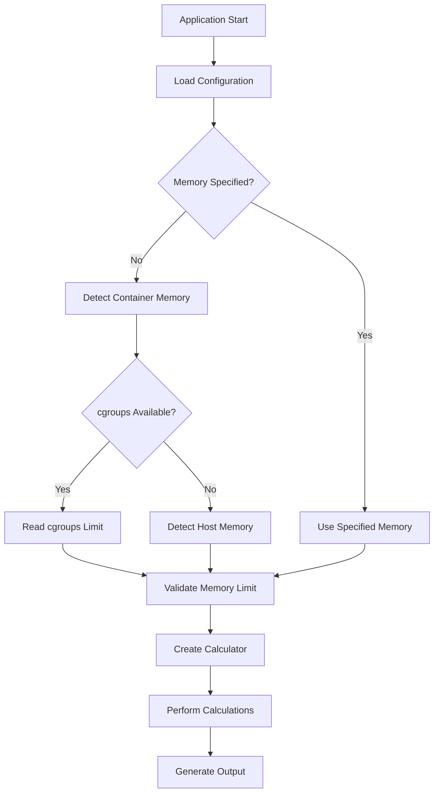
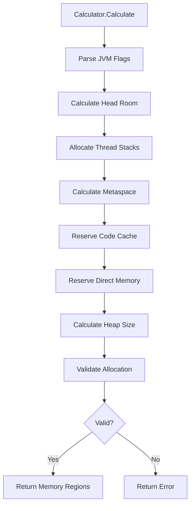

# Architecture Overview

## System Design

The memory calculator is built using a modular, layered architecture that separates concerns and provides clear interfaces between components. The design emphasizes testability, maintainability, and extensibility, with **build constraint support** for optimized deployment variants.

```
┌─────────────────────────────────────────────────────────────┐
│                     CLI Interface                           │
│              (cmd/memory-calculator)                        │
└─────────────────────────┬───────────────────────────────────┘
                          │
┌─────────────────────────▼───────────────────────────────────┐
│                Application Layer                            │
│  ┌─────────────┐  ┌──────────────┐  ┌─────────────────────┐ │
│  │   Config    │  │   Display    │  │      Errors        │ │
│  │ Management  │  │ Formatting   │  │    Handling        │ │
│  └─────────────┘  └──────────────┘  └─────────────────────┘ │
└─────────────────────────┬───────────────────────────────────┘
                          │
┌─────────────────────────▼───────────────────────────────────┐
│                  Business Logic Layer                       │
│  ┌─────────────┐  ┌──────────────┐  ┌─────────────────────┐ │
│  │    Calc     │  │    Count     │  │      Memory        │ │
│  │ Algorithms  │  │  Estimation  │  │    Utilities       │ │
│  └─────────────┘  └──────────────┘  └─────────────────────┘ │
└─────────────────────────┬───────────────────────────────────┘
                          │
┌─────────────────────────▼───────────────────────────────────┐
│                Infrastructure Layer                         │
│  ┌─────────────┐  ┌──────────────┐  ┌─────────────────────┐ │
│  │   CGroups   │  │     Host     │  │    File System     │ │
│  │  Detection  │  │  Detection   │  │     Access         │ │
│  └─────────────┘  └──────────────┘  └─────────────────────┘ │
└─────────────────────────────────────────────────────────────┘
```

## Package Architecture

### Layer 1: CLI Interface (`cmd/memory-calculator`)

**Purpose**: Entry point and command-line interface handling
**Responsibilities**:  
- Command-line argument parsing
- Application initialization and orchestration
- Integration with configuration and business logic layers
- Exit code management and error reporting

**Key Components**:
- `main()`: Application entry point with comprehensive error handling
- Flag parsing using Go's standard `flag` package
- Integration with all internal packages for complete functionality

### Layer 2: Application Layer

#### Configuration Management (`internal/config`)

**Purpose**: Centralized configuration handling and validation
**Responsibilities**:
- Command-line flag parsing and environment variable integration
- Configuration validation with comprehensive error reporting
- Default value management and override handling
- Buildpack environment variable support

**Key Components**:
```go
type Config struct {
    TotalMemory      string  // Memory specification
    ThreadCount      int     // Thread configuration  
    LoadedClassCount int     // Class count settings
    HeadRoom         int     // Safety margin percentage
    Path             string  // JAR scanning path
    Quiet            bool    // Output mode control
}
```

#### Display Formatting (`internal/display`)

**Purpose**: Output formatting and JVM argument generation
**Responsibilities**:
- Human-readable output formatting with tables and sections
- JVM argument string generation and validation
- Quiet mode output for scripting integration
- Error message formatting and presentation

**Key Components**:
- `Formatter`: Main formatting engine with multiple output modes
- JVM flag generation with proper escaping and validation
- Template-based output for consistent formatting

#### Error Handling (`pkg/errors`)

**Purpose**: Structured error management with rich context
**Responsibilities**:
- Typed error creation with categorization
- Error context preservation and chaining
- Integration with Go's standard error interfaces
- Detailed error reporting for debugging

**Key Components**:
```go
type MemoryCalculatorError struct {
    Type    ErrorType  // Error category
    Message string     // Description
    Context Context    // Additional context
    Cause   error      // Underlying cause
}
```

### Layer 3: Business Logic Layer

#### Memory Calculation (`internal/calc`)

**Purpose**: Core memory calculation algorithms and business logic with build variant support
**Responsibilities**:
- JVM memory region allocation algorithms
- Memory distribution optimization across heap, metaspace, stacks
- JVM flag parsing and override handling (build-variant optimized)
- Mathematical calculations with overflow protection

**Build Variant Support**:
- **Standard Build**: Full regex-based JVM flag parsing (`calc_standard.go`)
- **Minimal Build**: Optimized string-based parsing (`calc_minimal.go`)
- **Identical Output**: Both variants produce consistent results

**Key Components**:
```go
type Calculator struct {
    HeadRoom         int   // Safety margin
    LoadedClassCount int   // Class metadata sizing
    ThreadCount      int   // Stack allocation
    TotalMemory      Size  // Available memory
}

type MemoryRegions struct {
    DirectMemory      Size  // Off-heap allocation
    Heap              Size  // Object storage
    Metaspace         Size  // Class metadata
    ReservedCodeCache Size  // JIT compilation
    Stack             Size  // Thread stacks
}
```

**Algorithm Flow**:
1. Parse existing JVM flags for overrides
2. Calculate head room reservation
3. Allocate thread stack memory
4. Calculate metaspace requirements
5. Reserve code cache and direct memory
6. Allocate remaining memory to heap
7. Validate total allocation fits available memory

#### Class Count Estimation (`internal/count`)

**Purpose**: JAR file analysis and class count estimation with build-optimized variants
**Responsibilities**:
- Recursive JAR/ZIP file scanning (standard build)
- File size-based estimation (minimal build)
- Accurate `.class` file counting with duplicate handling
- Framework-specific scaling factors (Spring Boot, etc.)
- Error handling for corrupted or inaccessible archives

**Build Variant Support**:
- **Standard Build**: Full ZIP/JAR processing with archive/zip dependency
- **Minimal Build**: Size-based estimation (`count_minimal.go`) without ZIP processing
- **Size Optimization**: 176KB reduction by eliminating archive dependencies

**Key Components**:
- `Counter`: Main scanning engine with build-variant implementations
- ZIP archive handling with memory-efficient streaming (standard only)
- Class count estimation with framework detection (both variants)
- Caching for performance optimization

#### Memory Utilities (`internal/memory`)

**Purpose**: Memory size parsing, conversion, and formatting
**Responsibilities**:
- Flexible memory unit parsing (B, K, KB, M, MB, G, GB, T, TB)
- Decimal value support with proper precision handling
- JVM-compatible memory format generation
- Human-readable output formatting

**Key Components**:
```go
type Size int64

func ParseSize(s string) (Size, error)      // Flexible parsing
func (s Size) String() string               // Human-readable
func (s Size) ToJVMArg() string            // JVM-compatible
```

### Layer 4: Infrastructure Layer

#### Container Detection (`internal/cgroups`)

**Purpose**: Container memory limit detection from cgroups
**Responsibilities**:
- cgroups v1 and v2 filesystem parsing
- Memory limit extraction with validation
- Container runtime compatibility (Docker, containerd, CRI-O)
- Graceful fallback handling

**Key Components**:
- `Detector`: Main detection engine with filesystem abstraction
- cgroups v1 support: `/sys/fs/cgroup/memory/memory.limit_in_bytes`
- cgroups v2 support: `/sys/fs/cgroup/memory.max`
- Validation and sanitization of detected values

#### Host Detection (`internal/host`)

**Purpose**: Host system memory detection for non-containerized environments
**Responsibilities**:
- Platform-specific memory detection (Linux, macOS)
- `/proc/meminfo` parsing on Linux systems
- Heuristic-based detection for macOS (CGO-free)
- Error handling for unsupported platforms

**Key Components**:
- `Detector`: Cross-platform detection interface
- Linux implementation using `/proc/meminfo`
- macOS implementation using system heuristics
- Graceful degradation for unsupported platforms

## Data Flow

### Memory Detection Flow



### Calculation Flow



## Design Principles

### 1. Separation of Concerns
Each package has a single, well-defined responsibility:
- `config`: Configuration management only
- `calc`: Pure calculation logic without I/O
- `cgroups`/`host`: Platform-specific detection
- `display`: Output formatting only

### 2. Dependency Inversion
Higher-level modules don't depend on lower-level modules. Both depend on abstractions:
- Calculator doesn't know about configuration sources
- Display doesn't know about calculation internals
- Detection is abstracted behind interfaces

### 3. Testability
All components are designed for comprehensive testing:
- Pure functions without side effects
- Dependency injection for external resources
- Mock-friendly interfaces
- Comprehensive error path testing

### 4. Performance
Optimized for production use:
- Minimal memory allocations
- Efficient algorithms (< 1ms execution time)
- Parallel processing where beneficial
- Caching for expensive operations

### 5. Error Handling
Structured error management throughout:
- Typed errors with rich context
- Error chaining for root cause analysis
- Graceful degradation where possible
- Detailed error messages for debugging

## Extension Points

### Adding New Memory Detection Methods

1. Implement the `Detector` interface:
```go
type Detector interface {
    DetectMemory() (int64, error)
}
```

2. Add detection logic to the detection chain
3. Include comprehensive tests for the new method

### Adding New Output Formats

1. Extend the `Formatter` interface:
```go
type Formatter interface {
    Format(regions MemoryRegions, config Config) (string, error)
}
```

2. Implement the new formatter
3. Add format selection logic

### Adding New Calculation Strategies

1. Extend the `Calculator` with new configuration options
2. Modify the calculation algorithm to support new strategies
3. Ensure backward compatibility with existing configurations

## Testing Strategy

### Unit Testing
- Individual function and method testing
- Mock external dependencies
- Edge case and error condition testing
- Performance benchmark testing

### Integration Testing
- End-to-end CLI testing with real binaries
- Container environment testing
- Cross-platform compatibility testing
- Buildpack integration testing

### Property-Based Testing
- Memory calculation property verification
- Configuration validation testing
- Error handling consistency testing

## Deployment Considerations

### Binary Distribution
- Cross-platform compilation (Linux, macOS, Windows)
- Static linking for container compatibility
- Minimal binary size optimization
- Security scanning and signing

### Container Integration
- Multi-stage Docker builds
- Distroless base images for security
- Health check integration
- Resource limit compatibility

### Monitoring and Observability
- Structured logging for debugging
- Performance metrics collection
- Error rate monitoring
- Usage analytics (opt-in)

This architecture provides a solid foundation for the memory calculator while maintaining flexibility for future enhancements and platform support.
